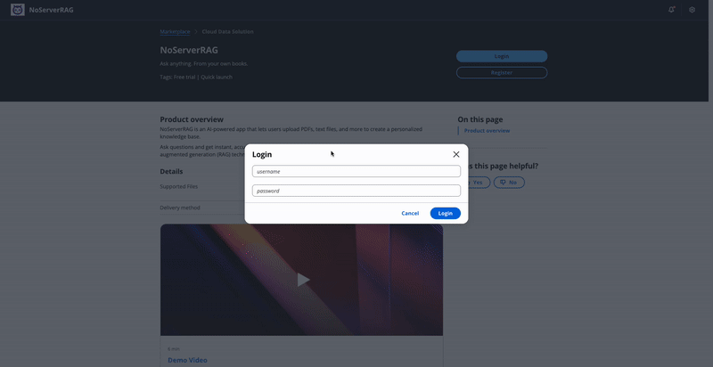
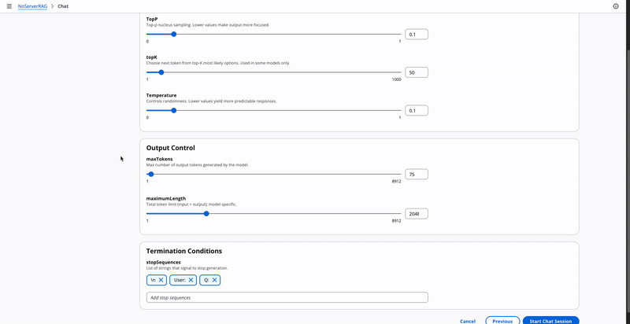

# No Server RAG

**No Server RAG** is a full-stack, **serverless Retrieval-Augmented Generation (RAG)** application deployed entirely on **AWS**. It enables secure, scalable, and maintenance-free AI-powered Q&A over your private documents using large language models (LLMs) from Amazon Bedrock.

Built using **AWS CDK**, **Lambda**, **S3**, **LanceDB**, and a modern **React frontend**, this sample provides a low-cost, production-ready foundation for enterprise-grade document chat experiences — with zero server management.

---

## Demo




---

## 📐 Architecture

A high-level view of the system components:


This system uses:
- **Amazon Bedrock** for LLM inference and embeddings
- **Amazon S3** for document storage
- **LanceDB** (in-serverless mode) for vector search
- **Amazon Cognito** for authentication
- **AWS Lambda + API Gateway** for compute and messaging
- **Amazon CloudFront** for global frontend delivery

---

## ✨ Features

- **chatplayground** – Ask questions and view LLM responses alongside retrieved document chunks.
- **chathistory** – View and manage past chat sessions, forward selective messages to test/debug prompts.
- **serverlesskb** – Store and retrieve documents via LanceDB + S3, eliminating the need to manage vector DB infrastructure.
- **promptmanagement** – Allow users to override system prompts in the UI.
- **dynamicprompt** – Change default prompt templates globally by editing `prompt-templates.yml` and running a script.

---

## ⚙️ Prerequisites

Ensure the following are installed:

- [Node.js v18+](https://nodejs.org/) (use `nvm`)
- [Docker](https://www.docker.com/)
- [AWS CDK v2 (>= 2.142.1)](https://docs.aws.amazon.com/cdk/latest/guide/home.html)
- AWS credentials (configured via `aws configure`)
- Access to **Amazon Bedrock** in your target region

---

## 🌍 Supported AWS Regions

This project supports AWS regions where **Amazon Bedrock** and embedding models are available:

```

us-east-1, us-east-2, us-west-2, eu-central-1,
eu-west-2, eu-west-3, ap-south-1,
ap-southeast-2, ap-northeast-1, ca-central-1, sa-east-1

````

---

## 🧾 Embedding Configuration

To set your default embedding model, update `lib/llm-config.json`:

```json
{
  "us-west-2": {
    "embedding": {
      "model": "amazon.titan-embed-text-v1",
      "size": 1536
    }
  }
}
````

> ⚠️ Do not change the embedding model after deployment — it may result in incorrect or inconsistent retrieval behavior.

---

## 📦 Installation

```bash
nvm use        # Ensure Node.js 18 is active
npm install    # Install project dependencies
```

---

## 🚀 Deployment

> **Recommended deployment region:** `us-west-2`

### Step 1 – Deploy the stack

```bash
cdk deploy
```

### Step 2 – Save output values

After deployment, you'll get several important outputs:

* `WebDistributionName`: URL to access the frontend
* `FrontendConfigS3Path`: S3 path for frontend config JSON
* Cognito credentials and authentication details

---

## 🧪 Running Frontend Locally

1. **Fetch Frontend Configuration**

```bash
./fetch-frontend-config.sh ServerlessRagOnAwsStack
# OR manually:
aws s3 cp s3://.../appconfig.json ./resources/ui/public/
```

2. **Start Local Dev Server**

```bash
cd resources/ui
npm install
npm run dev
```

This will run the Vite-powered React app on `http://localhost:5173`.

---

## 🔁 Changing Default Prompt Templates

To update the default system prompt used by all users:

1. Open and edit `prompt-templates.yml`
2. Save changes
3. Run:

```bash
npx ts-node update-default-prompt-templates.ts
```

> ⚠️ You may need to pass AWS region or profile using environment variables, depending on your setup.

---

## 🧠 Example Configuration File

This file (`appconfig.json`) is used by the frontend to connect to backend resources:

```json
{
  "inferenceURL": "https://xxxxxxxxxxxxx.lambda-url.us-west-2.on.aws/",
  "websocketURL": "wss://xxxxxxxxxx.execute-api.us-west-2.amazonaws.com/Prod",
  "websocketStateTable": "ServerlessRagOnAwsStack-websocketStateTable-xxxxxx",
  "region": "us-west-2",
  "bucketName": "ServerlessRagOnAwsStack-documentsbucket-xxxxxxxxx",
  "auth": {
    "user_pool_id": "us-west-2_XXXXXXXXXX",
    "aws_region": "us-west-2",
    "user_pool_client_id": "XXXXXXXXXX",
    "identity_pool_id": "us-west-2:XXXXX-XXXX-XXXXXX",
    "standard_required_attributes": ["email"],
    "username_attributes": ["email"],
    "user_verification_types": ["email"],
    "password_policy": {
      "min_length": 8,
      "require_numbers": true,
      "require_lowercase": true,
      "require_uppercase": true,
      "require_symbols": true
    },
    "unauthenticated_identities_enabled": true
  },
  "version": "1",
  "storage": {
    "bucket_name": "ServerlessRagOnAwsStack-documentsbucket-XXXXXXXXXXX",
    "aws_region": "us-west-2"
  }
}
```

---

## 📄 License

This project is open-sourced under the [MIT License](LICENSE).

---

## 🙌 Acknowledgments

Built with love using [Amazon Bedrock](https://aws.amazon.com/bedrock/), [AWS CDK](https://docs.aws.amazon.com/cdk/), and [LanceDB](https://lancedb.github.io/lancedb/).

---

**No Server RAG** – A zero-server RAG application template for private, production-ready document Q\&A.
